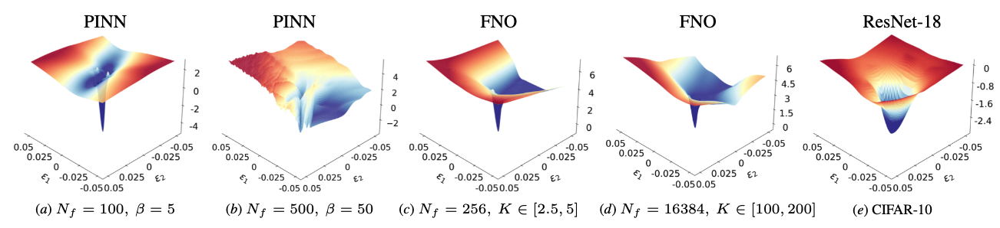
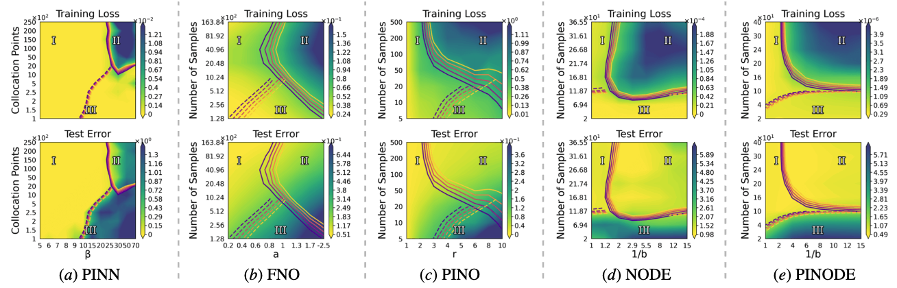

# :mountain: Multi-regime Analysis in Scientific Machine Learning

[](https://arxiv.org/abs/2605.29153)

> **[ICML 2026] Unveiling Multi-regime Patterns in SciML: Distinct Failure Modes and Regime-specific Optimization**  
> [Yuxin Wang](https://leastima.github.io/), [Yuanzhe Hu](https://hust-ai-hyz.github.io/), [Xiaokun Zhong](https://www.kenxzhong.com/), [Xiaopeng Wang](https://stephenw830.github.io/), [Haiquan Lu](https://scholar.google.com/citations?user=S1brcdYAAAAJ&hl=en), [Tianyu Pang](https://p2333.github.io/), [Michael W. Mahoney](https://www.stat.berkeley.edu/~mmahoney/), [Yujun Yan](https://sites.google.com/umich.edu/yujunyan/home), [Pu Ren](https://paulpuren.github.io/), [Yaoqing Yang](https://sites.google.com/site/yangyaoqingcmu/)

This repository provides the official implementation of our empirical analysis of widely used scientific machine learning (SciML) models, including:

- **5 models**: PINNs, FNOs, NeuralODEs, Physics-informed NOs, Physics-informed NeuralODEs.
- **7 optimization and training methods**: Adam, L-BFGS, NNCG, Augmented Lagrangian Method, Curriculum Learning, RoPINN, and SGD.
- **8 physical systems**: convection, reaction, wave, reaction-diffusion, Poisson, Advection-diffusion, Darcy flow, nonlinear Pendulum.
- **Extensive evaluation metrics**: training loss, test error, 3D loss landscape, Hessian spectrum, etc.


## Overview

Neural networks trained under different hyperparameter settings can fall into distinct training **regimes**, with consistent behavior within regimes and qualitative differences across regimes. This paper studies such multi-regime behavior in SciML through a **regime-aware diagnostic framework** that jointly analyzes performance, training dynamics, and loss-landscape geometry.

### 🤔 Why is SciML difficult to train?

<p align="center">
  
</p>

**Illustrative loss landscapes of representative SciML models versus a standard ResNet.**
SciML models often exhibit sharp local minima and chaotic ridges, while standard computer vision models typically show the smooth, convex basin.


### 🗺️ Three-Regime Structure

Across all SciML models studied, a consistent three-regime pattern emerges on the (physical difficulty, data availability) configuration space:

| Regime | Name | Training Loss | Test Error | Description |
|--------|------|--------------|------------|-------------|
| **I** | Well-Trained | Low | Low | Optimization and generalization both succeed |
| **II** | Under-Trained | High | High | Optimization difficulty dominates; model fails to fit training objective |
| **III** | Over-Trained | Low | High | Data-limited failure; model fits supervision but does not generalize |

<p align="center">
  
</p>


### 🔍 Key Findings

1. The three-regime structure appears consistently across PINN, FNO, PINO, NODE, and PINODE.
2. Optimization effectiveness is **regime-specific**: no single optimizer performs well across all regimes.
3. SciML models exhibit novel pathological phenomena (e.g., *deceptive sharpness*, *deceptive flatness*) that challenge standard loss-landscape interpretations from computer vision.


## Repository Structure

```
sciml_multi_regime/
  PINN/           Physics-Informed Neural Networks (1D convection / reaction / wave / reaction-diffusion)
  PINO/           Physics-Informed Neural Operators (2D Darcy flow)
  FNO/            Fourier Neural Operators (2D Poisson / AD)
  NeuralODE/      Neural ODEs / Physics-Informed NODEs (nonlinear pendulum)
  CNN/            CNN baseline (ResNet-18, CIFAR-10)
  experiments/    Single-run experiment scripts for each module
```

### Module Map

| Module | Model | Benchmark | Entry Point | Optimizers | Based on |
|--------|-------|-----------|-------------|------------|----------|
| `PINN/` | PINN | 1D Convection, Reaction, Wave, Reaction-diffusion | `PINN/run_experiment.py` | Adam, L-BFGS, ALM, NNCG, CL, RoPINN | [opt_for_pinns](https://github.com/pratikrathore8/opt_for_pinns), [RoPINN](https://github.com/thuml/RoPINN) |
| `PINO/` | PINO (FNO2d backbone) | 2D Darcy Flow | `PINO/scripts/darcy_sweep.py` | Adam, L-BFGS, ALM, NNCG, CL | [physics_informed](https://github.com/neuraloperator/physics_informed) |
| `FNO/` | FNO | 2D Poisson, Advection-Diffusion | `FNO/train.py` | Adam | [neuraloperator](https://github.com/neuraloperator/neuraloperator) |
| `NeuralODE/` | NODE / PINODE | Nonlinear Pendulum | `NeuralODE/run_sweep.py` | Adam, L-BFGS, ALM, NNCG, CL | [torchdiffeq](https://github.com/rtqichen/torchdiffeq) |
| `CNN/` | ResNet-18 | CIFAR-10 | `CNN/run_exp.py` | SGD | [PyHessian](https://github.com/amirgholami/PyHessian), [loss-landscape](https://github.com/tomgoldstein/loss-landscape) |


## Data

Different modules use different data sources; see the table below.

| Module | Data source | Action required |
|--------|-------------|-----------------|
| **PINN** | Generated on-the-fly (analytical / numerical PDE solution) | None — pass `--new_data` to regenerate |
| **PINO** | Self-generated via GRF + FDM solver | See below |
| **FNO** | Self-generated via FDM / spectral solvers | See below |
| **NeuralODE** | Generated on-the-fly via `scipy.integrate.solve_ivp` | None |
| **CNN** | CIFAR-10, auto-downloaded by `torchvision` | None |

### PINO — 2D Darcy Flow

The PINO experiments use piecewise-constant coefficient fields generated by thresholding a 2D Gaussian Random Field (GRF), following the setup of [Li et al. (2021)](https://github.com/neuraloperator/neuraloperator).

```bash
cd PINO
# Generates piececonst_r{R}_N1024_smooth.mat (train) and _smooth2.mat (test)
python scripts/generate_darcy.py --r 10 --N 421 --n_samples 1024 --seed 0 --outdir data/
```

### FNO — 2D Poisson and Advection-Diffusion

FNO data is generated by our own FDM / pseudo-spectral solvers and stored as HDF5 files.

```bash
cd FNO
python utils/gen_data_poisson.py      # 2D Poisson
python utils/gen_data_advdiff.py      # 2D Advection-Diffusion
```

## Environment Setup

All experiments were run on NERSC Perlmutter (A100 GPUs) using a shared conda environment.

```bash
# Create environment (example using conda)
conda create -n sciml python=3.11
conda activate sciml

# Core dependencies
pip install torch torchvision numpy scipy matplotlib tqdm wandb h5py
pip install torchdiffeq          # NeuralODE
pip install ruamel.yaml          # FNO config parsing

# Module-specific extras
pip install -r PINN/requirements.txt
pip install -r NeuralODE/requirements.txt
pip install -r FNO/requirements.txt
```


## Quickstart

### PINN — 1D Convection, single run

```bash
cd PINN
python run_experiment.py \
    --pde convection \
    --pde_params '{"beta":10}' \
    --opt lbfgs \
    --num_res 5000 \
    --initial_seed 0 \
    --save_path /path/to/output \
    --new_data
```

Supported `--opt` values: `adam`, `lbfgs`, `alm`, `nncg`, `cl`, `adam_lbfgs`.

### PINO — 2D Darcy flow, single run

```bash
cd PINO

# (Optional) generate data:
python scripts/generate_darcy.py --r 4 --n_samples 1000 --seed 0

# Adam :
python scripts/darcy_sweep.py \
    --optimizer adam --steps 15000 \
    --r 4 --n_samples 1000 --seed 0 --gpu 0 \
    --outdir /path/to/output/adam

# L-BFGS :
python scripts/darcy_sweep.py \
    --optimizer lbfgs --steps 1 \
    --r 4 --n_samples 1000 --seed 0 --gpu 0 \
    --outdir /path/to/output/lbfgs
```

Supported `--optimizer` values: `adam`, `lbfgs`, `alm`, `nncg`, `cl`.

### NeuralODE — Nonlinear Pendulum, single run

```bash
cd NeuralODE

# Adam baseline:
python run_sweep.py \
    --optimizer Adam --physics-mode pinn \
    --inv-b-values 8 --horizon-values 20 --seeds 0 \
    --epochs 600 --cuda \
    --out-dir /path/to/output/adam

# ALM (LBFGS inner, 500-step warmup):
python run_sweep.py \
    --optimizer LBFGS --physics-mode pinn_alm \
    --inv-b-values 8 --horizon-values 20 --seeds 0 \
    --alm-outer-iters 50 --alm-warmup-epochs 500 --cuda \
    --out-dir /path/to/output/alm
```

Supported `--optimizer` values: `Adam`, `LBFGS`, `Adam_NNCG`. CL is enabled via `--cl-warmup`.

### FNO — 2D Poisson, single run

```bash
cd FNO

# Generate data first (if not using pre-generated files):
python utils/gen_data_poisson.py

# Train FNO:
python train.py \
    --yaml_config config/operators_poisson_64K.yaml \
    --config poisson_scale_k1.0_2.5_val1024_64K \
    --root_dir /path/to/output \
    --run_num 0 \
    --lr 1e-3 --batch_size 128 --max_epochs 500
```

Switch to Advection-Diffusion or Helmholtz by changing `--yaml_config` and `--config` to the corresponding entries in `FNO/config/`.

### CNN — ResNet-18 on CIFAR-10

```bash
cd CNN
python run_exp.py \
    --model ResNet18 \
    --dataset CIFAR-10 \
    --epochs 200 \
    --batch_size 128 \
    --save_model
```

Add `--visualize` to generate 3D loss landscape plots after training.


## Running All Optimizers at Once

The `experiments/` directory contains ready-to-run single-experiment scripts for each module. Each script accepts environment variables to override the default setting.

```bash
# PINN (1D Convection, default: beta=10, n_res=5000, seed=0)
bash experiments/run_pinn_optimizer_comparison.sh

# PINO (2D Darcy, default: r=10, n_samples=1000, seed=0)
bash experiments/run_pino_optimizer_comparison.sh

# PINODE (Pendulum, default: 1/b=8, horizon=20, seed=0)
bash experiments/run_node_optimizer_comparison.sh

# FNO (2D Poisson, default config)
bash experiments/run_fno_training.sh

# CNN (ResNet-18 on CIFAR-10)
bash experiments/run_cnn_training.sh
```

Override any setting via environment variables, e.g.:

```bash
R=5 N_SAMPLES=500 SEED=1 GPU=2 bash experiments/run_pino_optimizer_comparison.sh
BETA=30 N_RES=10000 bash experiments/run_pinn_optimizer_comparison.sh
INV_B=4 HORIZON=40 bash experiments/run_node_optimizer_comparison.sh
```

---

## Acknowledgements

This project builds on the following open-source repositories:

- **[opt_for_pinns](https://github.com/pratikrathore8/opt_for_pinns)** — PINN optimizer comparison framework (Rathore et al., ICML 2024), basis of `PINN/`
- **[RoPINN](https://github.com/thuml/RoPINN)** — region-optimized PINNs (THUML @ Tsinghua), included as `PINN/RoPINN/`
- **[physics_informed](https://github.com/neuraloperator/physics_informed)** — physics-informed neural operator codebase, basis of `PINO/`
- **[neuraloperator](https://github.com/neuraloperator/neuraloperator)** — FNO architecture and Darcy benchmark data format used by `FNO/`
- **[torchdiffeq](https://github.com/rtqichen/torchdiffeq)** — ODE solver backend for `NeuralODE/`
- **[PyHessian](https://github.com/amirgholami/PyHessian)** — Hessian spectrum computation used in `CNN/`
- **[loss-landscape](https://github.com/tomgoldstein/loss-landscape)** — loss landscape visualization methodology used in `CNN/`

---

## Citation

```bibtex
@misc{wang2026unveilingmultiregimepatternssciml,
      title={Unveiling Multi-regime Patterns in SciML: Distinct Failure Modes and Regime-specific Optimization}, 
      author={Yuxin Wang and Yuanzhe Hu and Xiaokun Zhong and Xiaopeng Wang and Haiquan Lu and Tianyu Pang and Michael W. Mahoney and Yujun Yan and Pu Ren and Yaoqing Yang},
      year={2026},
      eprint={2605.29153},
      archivePrefix={arXiv},
      primaryClass={cs.LG},
      url={https://arxiv.org/abs/2605.29153}, 
}
```
